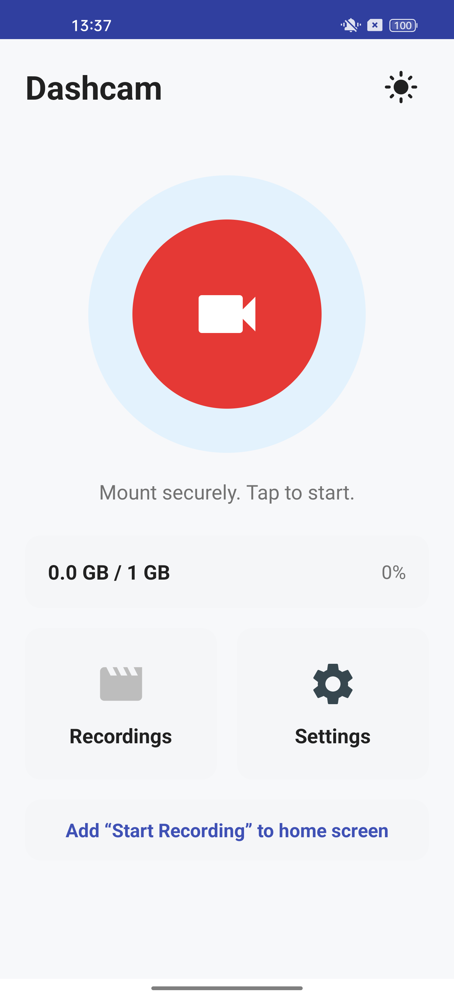
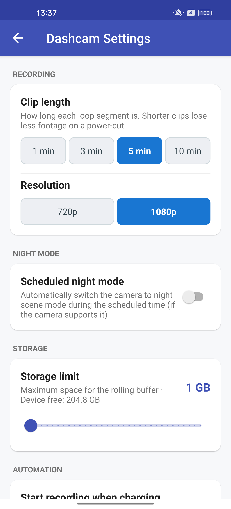

# Sentry — Dash Cam for Android

Sentry turns your Android phone into a capable dash cam. It records continuously in the
background while you use other apps (navigation, music, etc.), keeping the road on record
without taking over your screen. Recordings loop within a storage budget you set, so the app
runs indefinitely without filling up your phone, and important moments can be starred so they
are never overwritten.

Sentry is a modernized rebuild of the original Open Dash Cam project, updated for Android 13,
rewritten on top of CameraX, and extended with loop recording, an on-video overlay, a
recordings browser, safety automation, and more.

## Screenshots

| Home | Settings |
| :--: | :------: |
|  |  |

## Features

- **Background loop recording** — records in fixed-length clips using the rear camera via a
  foreground service; keeps running while you use other apps.
- **Storage-budgeted rotation** — set a storage limit and clip length; the oldest non-starred
  clips are automatically deleted to make room for new ones.
- **Save / star clips** — mark the current moment as starred so it survives rotation.
- **Burned-in overlay** — date, time, and GPS location/speed are drawn onto the video itself
  (CameraX `OverlayEffect`).
- **Recordings browser** — All/Starred tabs, total count and size, multi-select delete, and an
  empty state; clips are organized into `yyyy-MM-dd/HH` folders.
- **Live view** — a real-time preview with GPS/speed HUD that updates every second.
- **On-screen widget** — a draggable REC widget floats over other apps; tap it to open a quick
  menu (view recordings, save recording, settings, quit).
- **Home-screen shortcut** — add a "Start Recording" launcher shortcut (from **Settings**) that
  begins recording immediately.
- **Resolution options** — choose recording resolution; 4K/UHD is offered only on devices whose
  camera reports UHD support to CameraX.
- **Scheduled night mode** — enable a schedule (default 6:00 PM → 6:00 AM, phone local time) via
  an inline start/end time picker; the recorder applies the camera's night scene mode during the
  scheduled window.
- **Theme switcher** — cycle System / Light / Dark from the home screen; the choice is persisted
  and applied app-wide.
- **Safety features** — overheating alert above a chosen battery temperature, and optional
  auto-shutdown on low battery when unplugged.
- **Charge automation** — optionally auto-start recording when the charger is connected and
  auto-stop when it is disconnected.

## How it works

1. Launch the app — you land on a **home screen** (recording does **not** start automatically).
2. Grant the required permissions (camera, microphone, notifications, overlay, and optionally
   location for the GPS overlay/HUD).
3. Tap the **REC** button (or a "Start Recording" shortcut) to begin. A floating REC widget
   appears and recording starts in the background.
4. Use any other app freely. Sentry keeps recording in fixed-length clips and rotates them within
   your storage budget.
5. Tap the widget to open the menu — view recordings, star the current clip, open settings, or
   stop.

## Architecture (quick map)

The core functionality is split across a few components under `mobile/src/main/java/app/sentry/`:

- [`BackgroundVideoRecorder`](mobile/src/main/java/app/sentry/BackgroundVideoRecorder.java) —
  foreground service that records looped clips with CameraX, rotates them against the storage
  quota, applies night mode on schedule, and manages the on-video overlay.
- [`WidgetService`](mobile/src/main/java/app/sentry/WidgetService.java) — draws the floating
  widget icons over other apps and routes their actions.
- [`MainActivity`](mobile/src/main/java/app/sentry/MainActivity.java) — the home screen (REC
  button, storage summary, shortcuts, theme switcher).
- [`ViewRecordingsActivity`](mobile/src/main/java/app/sentry/ViewRecordingsActivity.java) — the
  recordings browser (RecyclerView over MediaStore).
- [`LiveViewActivity`](mobile/src/main/java/app/sentry/LiveViewActivity.java) — real-time preview
  with the GPS/speed HUD.
- [`SettingsActivity`](mobile/src/main/java/app/sentry/SettingsActivity.java) — clip length,
  storage limit, resolution, night-mode schedule, and safety settings.
- [`PowerConnectionReceiver`](mobile/src/main/java/app/sentry/PowerConnectionReceiver.java) —
  charge-automation start/stop.
- [`Util`](mobile/src/main/java/app/sentry/Util.java) — shared helpers (storage, preferences,
  night-mode schedule, theme).

## Requirements

- **Android 6.0 (API 23) or newer** — `minSdk 23`, `targetSdk 33`, `compileSdk 34`.
- **JDK 17** to build.
- Gradle wrapper is included (Gradle 8.2); no global Gradle install needed.

## Build & run

```bash
# from the repository root
./gradlew :mobile:assembleDebug          # macOS/Linux
.\gradlew.bat :mobile:assembleDebug      # Windows PowerShell
```

The debug APK is produced at:

```
mobile/build/outputs/apk/debug/mobile-debug.apk
```

Install it on a connected device with adb:

```bash
adb install -r mobile/build/outputs/apk/debug/mobile-debug.apk
```

> If Gradle can't find a JDK, set `JAVA_HOME` to a JDK 17 installation before building.

## Permissions

Sentry requests: camera and microphone (recording), notifications and foreground-service
(background recording), system alert window (the floating widget), wake lock (keep recording
while the screen is off), and — optionally — fine/coarse location for the GPS overlay and live
HUD. Location is optional; the app runs without it.

## Credits

Sentry is a modernized rebrand of the original [Open Dash Cam](https://github.com/maxneaga/open_dash_cam_android) project by **Maxim Neaga** and its community contributors. See [LICENSE](LICENSE) for terms — commercial use requires written permission by Maxim Neaga.
